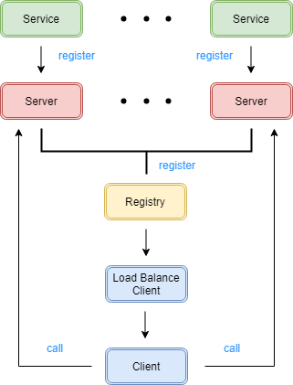

# Chionura

Chionura is a RPC(Remote Procedure Call) framework.



## FEATURES

- Registry;
- Service discovery;
- Load balance;
- Timeout processing;

## USAGES

1. Start registry server.

   ```java
   InetSocketAddress addr = new InetSocketAddress(host, port);
   HttpServer server = HttpServer.create(addr,0);
   server.createContext(path, new Registry(timeout));
   server.start();
   ```

2. Repeat post all server address.

   ```bash
   curl -d "address=host:port" -X POST path
   ```

3. Repeat start all server and register service.

   ```java
   Service service = new Service(full_path_of_class);
   if (service.classIsAvailable()) {
       service.newService();
   }
   ServiceRegister.registerService(service);
   NIOServer server = new NIOServer(host, port);
   server.listen();
   ```

4. Create client and invoke method.

   ```java
   Header header = new Header();
   header.setServiceMethod(full_path_of_class.method);
   header.setArgs(args);
   
   RegistryDiscovery d = new RegistryDiscovery(registryAddress, 0);
   LBClient client = new LBClient(d, Constants.RANDOMSELECT);
   try {
       String result = (String) client.call(header);
       System.out.println(result);
   } catch (IOException e) {
       e.printStackTrace();
   }
   ```

## LICENSE

Chionura is distributed under the terms of the GPL-3.0 License.